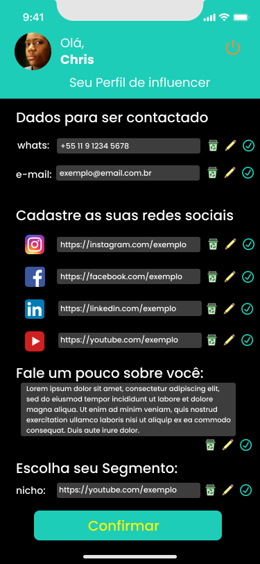
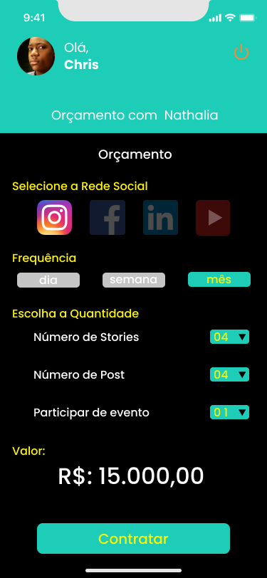

# legacyInfluencer
App aimed at finding influencers in your region that match your business

 
  
    
  
  

 

Bem vindo ao um projeto criado para a conclusão de curso de Análise e Desenvolvimento de Sistemas pela Univali. O desenvolvimento do projeto será construído em equipe: Isaac, Uélington, Willian e Philipe

* App (ReactNative)
* Servidor (C#)

​	Até o momento foram criadas as primeiras linhas de código referente ao construção do App para Android e IOS, abaixo temos as primeiras telas do projeto.

<table border="1">
    <thead>
    	<tr>
        	<th>Login</th>
            <th>Tela de Inicio</th>
            <th>Futuros e Sessões</th>
            <th>Lições</th>
        </tr>
    </thead>
    <tbody>
    	<tr>
        	<td align="center"></td>
          <td align="center"></td>
          <td align="center"></td>
          <td align="center"></td>
          <td align="center"></td>
          <td align="center"></td>
        </tr>
    </tbody>
</table>
